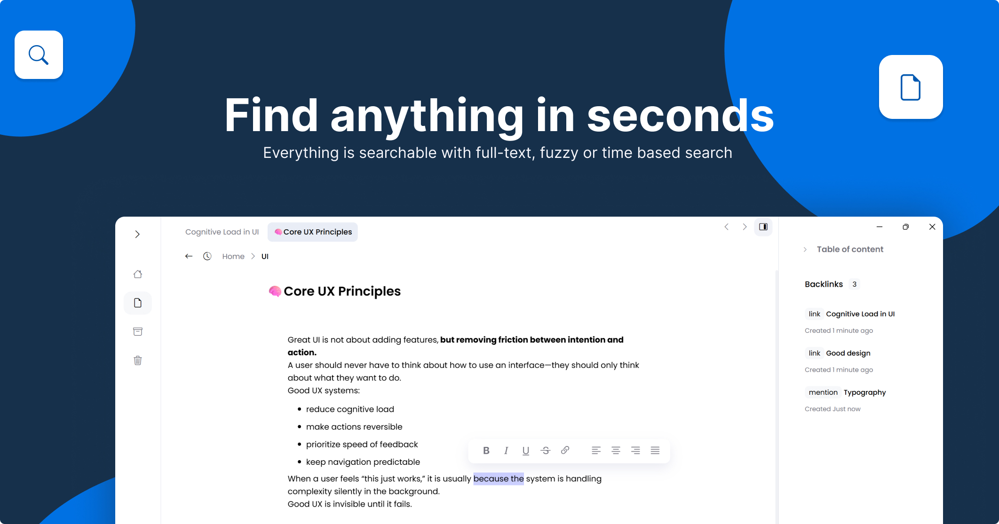

# A complete personal knowledge system. Ready from day one.

## [Try it out for free](https://fotonn.com/download)

 

## ✨What is Fotonn?
Fotonn is a fast, local-first knowledge app that helps you capture, connect, and find your notes instantly, without plugins, setup, or friction.
It gives you the power of advanced note systems, but feels as simple as a notes app.

 

## Why Fotonn?
- Find any note instantly
- Connect ideas without friction
- Stay organized without setup
- Your notes stay yours
- No plugin management, works out-of-the-box 

 

## 🧠Built for
- Students organizing study notes
- Developers building personal knowledge bases
- Writers connecting ideas
- Anyone who wants a “second brain” without complexity

 

## ⚡Core philosophy
Fotonn is built around one idea:
> Powerful systems should feel simple to use.

No plugin ecosystems. \
No configuration overload. \
No learning curve that takes weeks. 

Just open and start thinking.

 

## 📦 Downloads
Latest releases: https://github.com/fotonn-desktop/fotonn-app/releases \
Website: [fotonn.com](https://fotonn.com)

 

## 🗺 Roadmap
Curious about what’s coming next? \
Check the [Roadmap](https://fotonn.com/roadmap) to see planned features and upcoming improvements.

 

## 🤝 Community & feedback
This repo is the central place for:

- Bug reports
- Feature requests
- Discussions
- Release updates

Before opening an issue:
- Search existing issues
- Make sure you're on the **latest version**

 

## 📦 Releases
Stay up to date with the latest versions of Fotonn Desktop:
- **GitHub Releases:** You can grab the latest or previous versions of the app in the releases section.
- **Official Website:** You can also get the latest stable version at [fotonn.com](https://fotonn.com).

 

## 📍Links
- [Documentation](https://fotonn.com/documentation)
- [Official website](https://fotonn.com)
- [Changelog](https://fotonn.com/changelog)
- [Privacy Policy](https://fotonn.com/privacy-policy)

---
## ❤️ Thanks

Thank you for helping improve Fotonn Desktop.

Your feedback and contributions make the project better every day.
